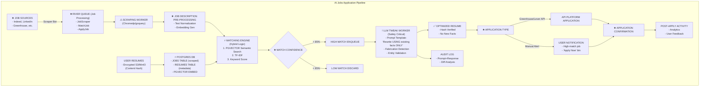

# ResonantHire

### Workflow

```mermaid
graph TD
    subgraph "AI Jobs Application Pipeline"
        %% Data Inputs
        job_sources["★ JOB SOURCES<br/>- Indeed, LinkedIn<br/>- Greenhouse, etc."]
        user_resumes["USER RESUMES<br/>- Encrypted S3/MinIO<br/>(Content Hash)"]

        %% Initial Processing
        river_queue["★ RIVER QUEUE (Job Processing)<br/>- JobScraper<br/>- MatchJob<br/>- ApplyJob"]
        postgres["⚡ POSTGRES DB<br/>- JOBS TABLE (scraped)<br/>- RESUMES TABLE (metadata)<br/>- PGVECTOR EMBED"]
        scraping_worker["⚠ SCRAPING WORKER<br/>(Chromedp/goquery)"]

        %% Matching Logic
        preprocessing["★ JOB DESCRIPTION PRE-PROCESSING<br/>- Text Normalization<br/>- Embedding Gen"]
        matching_engine["⚡ MATCHING ENGINE (Hybrid Logic)<br/>1. PGVECTOR Semantic Search<br/>2. TF-IDF<br/>3. Keyword Score"]
        match_confidence{"★ MATCH CONFIDENCE"}

        %% Decision & Tailoring
        high_match["HIGH MATCH ENQUEUE"]
        low_match["LOW MATCH DISCARD"]
        llm_worker["! LLM TWEAK WORKER (Safety Critical)<br/>- Prompt Template: 'Rewrite USING existing facts ONLY'<br/>- Fabrication Detection<br/>- Entity Validation"]

        %% Outputs & Application
        optimized_resume["✅ OPTIMIZED RESUME<br/>- Hash Verified<br/>- No New Facts"]
        audit_log["AUDIT LOG<br/>- Prompt+Response<br/>- Diff Analysis"]
        app_type["★ APPLICATION TYPE"]
        api_platform["API PLATFORM APPLICATION"]
        user_notification["USER NOTIFICATION<br/>- High-match job<br/>- 'Apply Now' btn"]
        app_confirmation["★ APPLICATION CONFIRMATION"]
        post_apply["POST-APPLY ACTIVITY<br/>- Analytics<br/>- User Feedback"]

        %% --- Flow Connections ---
        job_sources -- "Scraper Bot" --> river_queue
        user_resumes --> postgres

        river_queue --> scraping_worker
        scraping_worker --> preprocessing
        
        preprocessing --> matching_engine
        postgres --> matching_engine
        
        matching_engine --> match_confidence
        match_confidence -- "> 85%" --> high_match
        match_confidence -- "< 85%" --> low_match

        high_match --> llm_worker
        llm_worker --> optimized_resume
        llm_worker --> audit_log

        optimized_resume --> app_type
        app_type -- "Greenhouse/Lever API" --> api_platform
        app_type -- "Manual Alert" --> user_notification

        api_platform --> app_confirmation
        user_notification --> app_confirmation
        app_confirmation --> post_apply
    end
```
